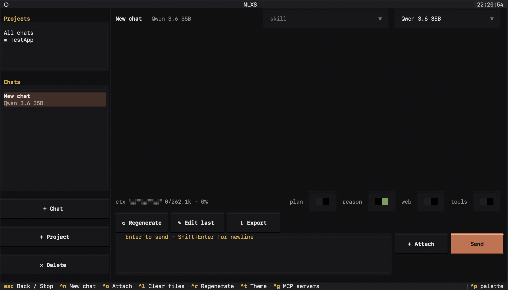

# MLX Server Launcher (MLXS)

A Claude-Code-styled terminal app (TUI) to launch and manage local
[`mlx_lm.server`](https://github.com/ml-explore/mlx-lm) (text LLMs) and
[`mlx_vlm.server`](https://github.com/Blaizzy/mlx-vlm) (vision-language models)
instances on Apple Silicon.

<p align="center">
  
</p>

- **Pick the engine** per profile: **mlx-lm** for text LLMs, **mlx-vlm** for
  vision-language models. The launcher emits each engine's correct flags (and routes
  vlm-only tuning like `--kv-bits` / `--max-kv-size` / `--enable-thinking` through the
  Custom box).
- **Drag & drop** a model folder onto the terminal (or paste a HuggingFace repo id).
- Tweak options (temperature, max-tokens, top-p/k, prompt cache, …) plus a free-form
  **custom params** box for anything else (e.g. quantized-KV-cache flags on servers that
  support them).
- **Launch** the server, see its address (`http://host:port/v1`) and **live logs**.
- **Save** named server profiles and quick-launch them.
- Connect to **Xcode 27** two ways: an OpenAI-compatible *Locally Hosted* provider, and
  an **ACP** (Agent Client Protocol) stdio agent (with agentic file edits).
- **Chat** with a running server in a built-in Claude-style UI (press `c`): projects +
  chats sidebar (create/delete with confirmation), streaming replies that render
  **Markdown with syntax-highlighted, copyable code / JSON blocks**, a thinking panel for
  reasoning models, a tok/s footer, **drag-and-drop file attachments** (images for vision
  models, text for any), a multiline prompt (Enter sends · Shift+Enter newline),
  regenerate / edit-last / export-to-Markdown, and a live **theme picker** (Ctrl+T).
- **Tool use in chat** (toggle *tools* in the chat): the model can call a built-in
  **web_search** (DuckDuckGo, no API key) and tools from any **MCP servers** you connect
  (stdio or SSE) — manage them with `m` on the dashboard or Ctrl+G in chat. Tool calling is
  native-first with a prompted-protocol fallback, so it works across models (Qwen, Gemma,
  Nemotron, GPT-OSS, MiniMax, Step, …).
- **Code in a folder**: set a project's **working directory** (`+ Project` / Ctrl+E) and the
  model gets file tools — `read` / `write` / `edit` / `delete` / `run_command` — scoped to
  that folder (paths can't escape it), with an **approve / deny prompt** before anything
  mutating. It reads `AGENTS.md` first if present.
- **Skills**: pick a `SKILL.md` instruction set per chat — bundled platform skills, your own
  **custom** ones, or installed **BMAD** skills; browse/create/install with `k`.
- **Plan mode**: a per-chat toggle that makes the model produce a plan for you to approve
  instead of taking action.
- **Context bar**: a live token-usage meter showing how much of the model's context window the
  conversation uses.
- **Dependency self-check**: detects missing `mlx_lm.server` / `mlx_vlm.server` and offers
  to install either (`p` on the dashboard).
- **Global install**: run it from anywhere like `claude`.

## Quick start

```sh
./run.sh
```

First run creates a `.venv` and installs the app's pure-Python deps (Textual, httpx,
agent-client-protocol, …). It does **not** install the model runtimes itself — the app
detects your existing `mlx_lm.server` / `mlx_vlm.server` on PATH, or offers to install
either for you.

## Install globally

```sh
./install.sh        # installs pipx via Homebrew, then exposes mlxs globally
mlxs                # then launch from anywhere
```

On macOS the installer uses **Homebrew** (`brew install pipx`) for a clean, isolated global
install. If you don't have Homebrew, it falls back to a local `.venv` + symlinks in
`~/.local/bin` (no Homebrew required, but you'll want that dir on your `PATH`).

## Requirements

- macOS on Apple Silicon, Python 3.10–3.14.
- [**Homebrew**](https://brew.sh) — recommended. It's the easiest way to get Python on a Mac,
  and `./install.sh` uses it to set up the global `mlxs` command (`brew install pipx`).
- `mlx-lm` (provides `mlx_lm.server`, for text LLMs) and/or `mlx-vlm` (provides
  `mlx_vlm.server`, for vision-language models). Install whichever you need — the app can
  install either for you.
